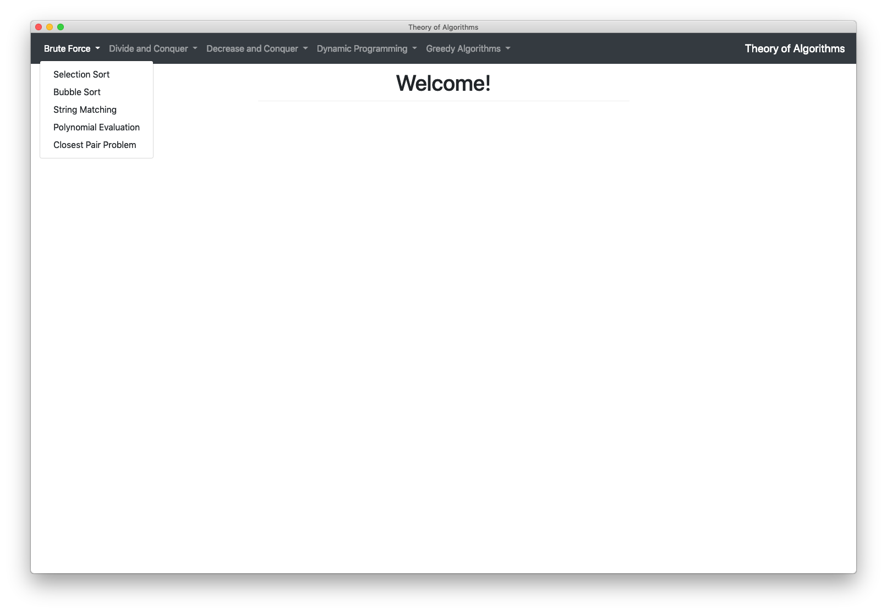
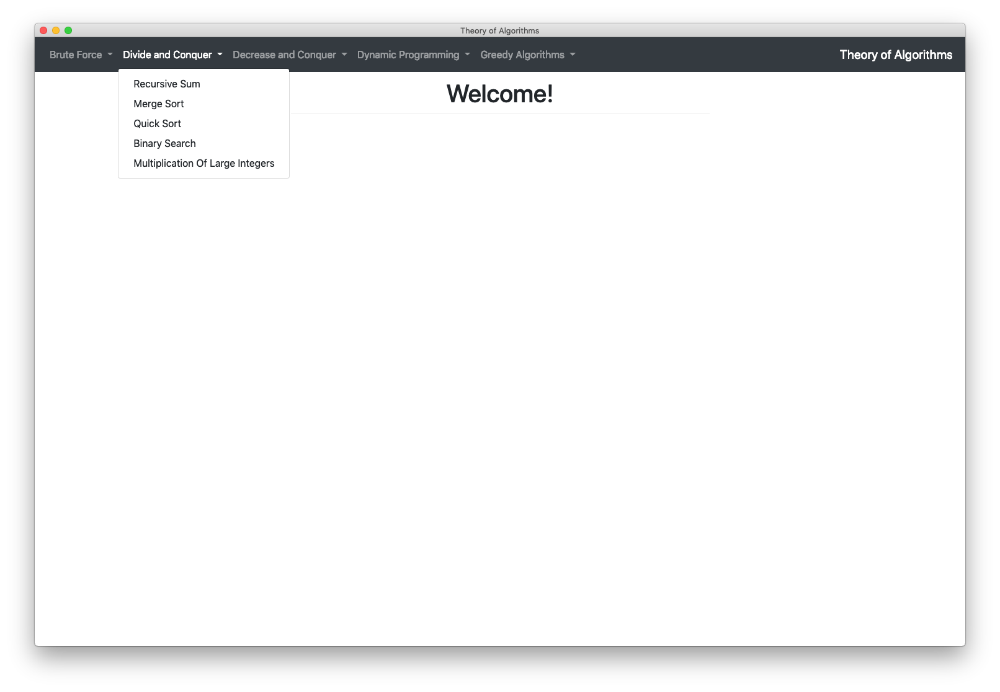
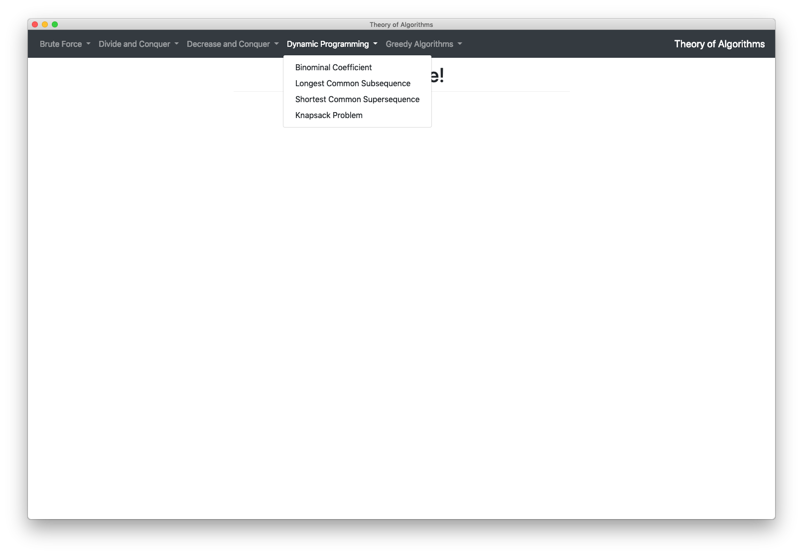
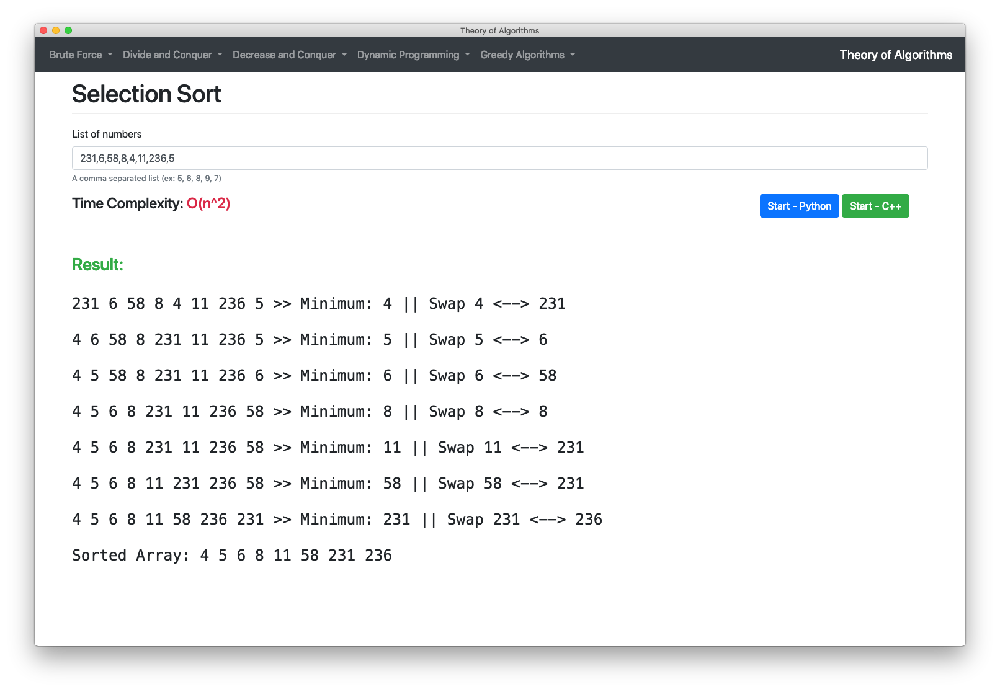

# Computer Algorithms

Electron app that contains multiple computer algorithms written in both Python and C++, used to demonstrate how these algorithms works.

## Algorithms implemented
**BruteForce**
* Selection Sort
* Bubble Sort
* String Matching
* Polynomial Evaluation
* Closest Pair Problem

**Divide and Conquer**
* Recursive Sum
* Merge Sort
* Quick Sort
* Binary Search
* Multiplication of Large Integers

**Decrease and Conquer**
* Insertion Sort

**Dynamic Programming**
* Binominal Coefficient
* Longest Common Subsequence (LCS)
* Shortest Common Subsequence (SCS)
* Knapsack Problem

**Greedy Algorithms**
* Huffman Coding

## Installation
```sh
$ git clone git@github.com:hossamelmansy/theory-of-algorithms.git
$ cd theory-of-algorithms
$ yarn
$ yarn start
```
or

```sh
$ git clone git@github.com:hossamelmansy/theory-of-algorithms.git
$ cd theory-of-algorithms
$ npm install
$ npm run start
```

## Note
**NEED TO COMPILE C++ FILES BEFORE RUNNING**

## Screenshots





## License
MIT